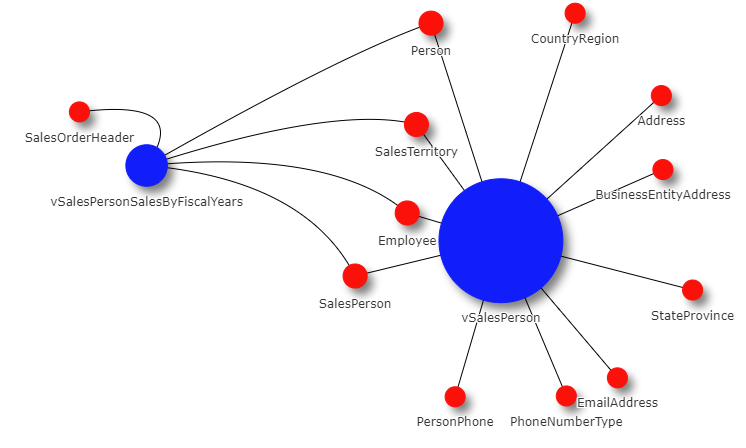

# FME_PythonNetworkVisualizations
 This repo contains a framework and example for using FME to generate a [PYVIS Network Visualization](https://pyvis.readthedocs.io/en/latest/index.html) while controlling the variables of the network. 
 
 This was generated from the [Microsoft 2019 Adventure Works Sample Database](https://docs.microsoft.com/en-us/sql/samples/adventureworks-install-configure?view=sql-server-ver16&tabs=ssms)
 
 The general idea is to map the relationships between _source_ and _desintation_ nodes in a network. In this case, the source and destination nodes are tables and table views as returned by the below (or similar) query. This could also be done by mapping the PK/FK keys in the database, however, the python script inside the FME workspace was written explicitly to identify and format VIEWS and TABLES to idenfity the relationships between the objects. 

 ~~~select distinct schema_name(v.schema_id) as schema_name,
       v.name as view_name,
	   V.type_desc as view_type,
       o.name as referenced_entity_name,
       o.type_desc as entity_type
from sys.views v
join sys.sql_expression_dependencies d
     on d.referencing_id = v.object_id
     and d.referenced_id is not null
join sys.objects o
     on o.object_id = d.referenced_id
 order by schema_name,
          view_name;
~~~

# SETUP
A few different python modules need to be installed into the FME Python Directory for this to function correctly 

1. Modules needed - __pandas, networkx, matplotlib, pyvis__
    - [FME Documentation for Python](https://docs.safe.com/fme/2020.0/html/FME_Desktop_Documentation/FME_IntegrationConsole/Workbench/Installing-Python-Packages.htm)
    - Windows command line example: `fme.exe python -m pip install pandas --target C:\Users\<user>\Documents\FME\Plugins\Python`
    - Linux command line example: `./fme python -m pip install pandas --target ~/Library/Application\ Support/FME/Plugins/Python`

2.Database Connections  

This repo has two examples.  
        - One workspace using a local JSON file (contained in the [ExampleData](ExampleData) folder)  
        - One utilizing a direct SQL database connection.  
        &ast; If you are unfamiliar with database connections and do not have any SQL connections set up, I suggest you use the [ExampleData](ExampleData) and the [GenerateSQLDiagrams_JSON_FILE_LOCAL.fmwt](GenerateSQLDiagrams_JSON_FILE_LOCAL.fmwt) file

# Example Outputs
See [Example Output Folder](ExampleOutput)
1. Download file
2. Open in Browser  
  
Sales.HTML Screenshot below  
  

