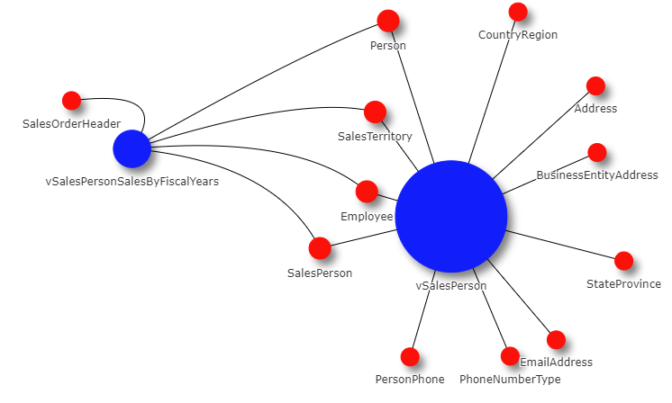

# FME_PythonNetworkVisualizations
 This repo contains a framework and example for using FME to generate and control the variables inside a PYVIS Network Visualization

# SETUP
A few different python modules need to be installed into the FME Python Directory for this to function correctly 

1. Modules needed - __pandas, networkx, matplotlib, pyvis__
    - [FME Documentation for Python](https://docs.safe.com/fme/2020.0/html/FME_Desktop_Documentation/FME_IntegrationConsole/Workbench/Installing-Python-Packages.htm)
    - Windows command line example: `fme.exe python -m pip install pandas --target C:\Users\<user>\Documents\FME\Plugins\Python`
    - Linux command line example: `./fme python -m pip install pandas --target ~/Library/Application\ Support/FME/Plugins/Python`

2.Database Connections  

This repo has two examples.  
        - One workspace using a local JSON file (contained in the [ExampleData](ExampleData) folder)  
        - One utilizing a direct SQL database connection.  
        &ast; If you are unfamiliar with database connections and do not have any SQL connections set up, I suggest you use the [ExampleData](ExampleData) and the [GenerateSQLDiagrams_JSON_FILE_LOCAL.fmwt](GenerateSQLDiagrams_JSON_FILE_LOCAL.fmwt) file

# Example Outputs
See [Example Output Folder](ExampleOutput)
1. Download file
2. Open in Browser  
  
  

